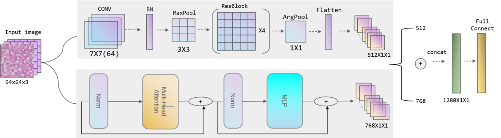

# Res-ViT 网络架构




Network for Swin-Transformer. The pytorch version.

If this works for you, please give me a star, this is very important to me.😊

1. Clone this repository.

```shell
git clone https://github.com/Leechion/Res-ViT
```

2. Install code from source.

```shell
cd Res-ViT
pip install -r requirements.txt
```

3. Download the **[flower dataset](https://github.com/Runist/Swin-Transformer/releases/download/dataset/flower_dataset.zip)**.
4. Download pretrain weights, the url in [model.py](https://github.com/Runist/Swin-Transformer/blob/master/model.py).
5. Start train your model.

```shell
python d_train.py --d_train-data-dir "train-data-path" --d_val-data-dir "val-data-path --device cuda:0
```

6. Get prediction of model.

```shell
python predict.py
```

7. Evaluate model.

```shell
python create_confusion_matrix.py --weights './weights/your own model.pth' --d_val-data-dir "val-data-path --device cuda:0
```

## Train your dataset

You need to store your data set like this:

```shell
├── d_train
│   ├── daisy
│   ├── dandelion
│   ├── roses
│   ├── sunflowers
│   └── tulips
└── validation
    ├── daisy
    ├── dandelion
    ├── roses
    ├── sunflowers
    └── tulips
```

## Reference

Appreciate the work from the following repositories:

- [microsoft](https://github.com/microsoft)/[Swin-Transformer](https://github.com/microsoft/Swin-Transformer)
- [WZMIAOMIAO](https://github.com/WZMIAOMIAO)/[swin-transformer](https://github.com/microsoft/Swin-Transformer)

## License

Code and datasets are released for non-commercial and research purposes **only**. For commercial purposes, please contact the authors.
